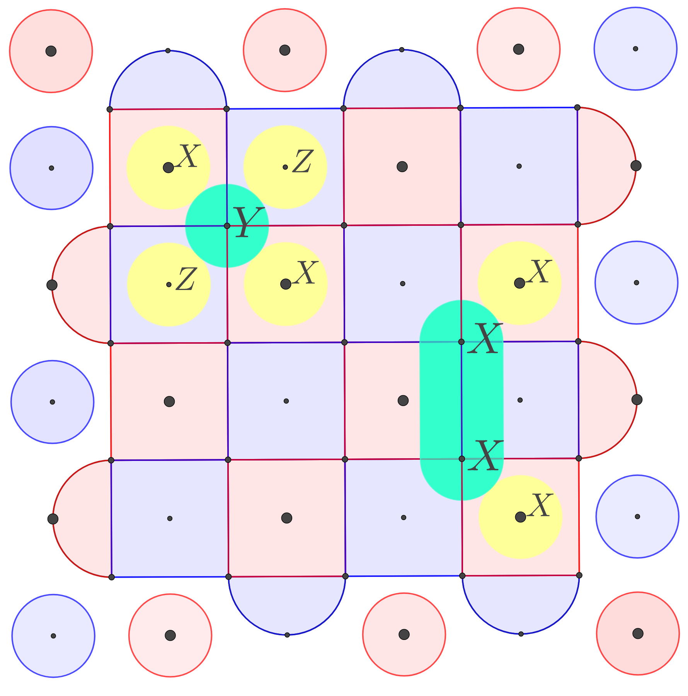

# Qiskit Topological Codes

## Motivation

Quantum computation is an inherently noisy process. Scalable quantum computers will require fault-tolerance to implement useful computation. There are many proposed approaches to this, but one promising candidate is the family of *topological quantum error correcting codes*.

Currently, the [`qiskit.ignis.verification.topological_codes`](https://qiskit.org/documentation/apidoc/verification.html#topological-codes) module provides a general framework for QEC and implements one specific example, the *repetition code*. Qiskit Topological Codes builds out the `topological_codes` module into a diverse family of QEC encoders and decoders, supporting the repetition code, XXXX/ZZZZ rotated surface code, and the XZZX rotated surface code.

Inspired by the [Qiskit Textbook](https://qiskit.org/textbook/ch-quantum-hardware/error-correction-repetition-code.html), we've written a full set of [jupyter notebook tutorials](./tutorials) to demonstrate the [circuit encoders](./topological_codes/circuits), [graph decoders](./topological_codes/fitters), and [benchmarking tools](./benchmarking) that compose Qiskit Topological Codes. These tutorials both demonstrate the elegance of QEC codes as well as the utility of this package -- please check them out!

## Codebase

<p align="center">

</p>

Topological QEC codes disperse, and thus protect, one quantum bit of logical information across many physical qubits. The classical repetition code distributes 1 bit of logical information across multiple imperfect physical bits (e.g. logical 0 is 000...0 and logical 1 is 111...1). In the classical repetition logical 0 bit, for example, a few physical bits may flip to 1, but the majority will very likely stay in 0, thus preserving the logical 0 bit. Similarly, the surface code protects one logical qubit in a grid of imperfect physical qubits against Pauli errors.

The `topological_codes` module can be broken down into `circuits` (encoders) and `fitters` (decoders). Additionally, unittests can be found in `tests` and benchmarking tools in `benchmarking`.


> The rotated surface code is based on the earlier theoretical idea of a [toric code](https://decodoku.blogspot.com/2016/03/6-toric-code.html), with periodic boundary conditions instead of open boundary conditions. This has been shown to be largely identical, but embedding a surface code on an actual device is much easier.

### Circuits

The `topological_codes.circuits` sub-module contains classes such as `XXZZQubit`, `XZZXQubit`, and `RepetitionQubit`, which each allow users to construct and manipulate circuits encoding one logical qubit using a particular QEC code.

For example, we can create and apply a logical X onto a `RepetitionQubit` as follows

```
qubit = RepetitionQubit({"d":3},"t")
qubit.logical_plus_z_reset()
qubit.stabilize()
qubit.logical_x()
qubit.stabilize()
qubit.readout_z()
qubit.draw(output='mpl', fold=150)
```


`topological_codes.circuits.circ` also allows users to create  `TopologicalRegister`s (treg: a collection of topological qubits) and `TopologicalCircuit`s (tcirc: a circuit built using a treg), the analog of `QuantumRegister` and `QuantumCircuit`.

We can, for example, create a tcirc and treg out of two `RepetitionQubit`s.
```
treg = TopologicalRegister(2, ctype="Repetition", params={"d": 3})
circ = TopologicalCircuit(treg)
circ.x(treg[0])
circ.stabilize(treg[1])
circ.x(1)
circ.draw(output='mpl', fold=500)
```


Learn more about circuits through encoder tutorials such as this [one](./tutorials/xxzz/1-circuits.ipynb) for the XXXX/ZZZZ rotated surface code.

### Fitters

TODO

### Benchmarking

TODO
## Acknowledgements

**Core Devs:** [Shantanu Jha](https://github.com/Phionx), [Jessie Chen](https://github.com/JazzyCH), [Aaron Householder](https://github.com/aaronhouseholder), [Allen Mi](https://github.com/Allenator)

Thanks to our mentor [James Wootton](https://github.com/quantumjim) (IBM) for invaluable feedback and support since the inception of this project at the IBM Qiskit - Summer Jam Hackathon 2020.

**Alums:** [Henry Liu](https://github.com/liuhenry), [Shraddha Singh](https://github.com/shraggy), [Will Sun](https://github.com/muirheadmaster), [Andy Ding](https://github.com/ZhenghaoDing)


## References

*Here's some reading material that we found particularly useful:*
- Presentation [slides](https://docs.google.com/presentation/d/1HC5tQkvOcfl5lPDWy-l8ZvsWW3AGf6jUCmMu_sz-cDY/edit?usp=sharing) and [video](https://www.youtube.com/watch?v=jb1qD0pZbF4&list=PLOFEBzvs-VvqQMAVaXoFlSqjqgbX5k-fL&index=18&ab_channel=QiskitQiskit) about this package to the Qiskit Advocate community at the November 2020 Qiskit Advocate Demo Session.
- [Surface Codes: Towards Practical Large-Scale Quantum Computation](https://arxiv.org/abs/1208.0928)
- [Stabilizer Codes and Quantum Error Correction](https://arxiv.org/pdf/quant-ph/9705052.pdf)
- [Multi-path Summation for Decoding 2D Topological Codes](https://quantum-journal.org/wp-content/uploads/2018/10/q-2018-10-19-102.pdf)
- [Qiskit Textbook - Introduction to Quantum Error Correction using Repetition Codes](https://qiskit.org/textbook/ch-quantum-hardware/error-correction-repetition-code.html)


<!-- ## Future Directions
The scope of the project is quite large, so we focused on completing a "minimum viable product" during the hackathon. However, there are many areas which we'd like to explore going forward. A few immediate ones:

* Expand `SurfaceCode(d, T).circuits` a full set of logical states (1, +, -) -- and ultimately logical gate operations for computation.
* Full benchmark of the physical-error to logical-error probabilities to determine the error correction threshold.
* More simulation runs: different X/Z error probabilities, more limited `coupling_map`, etc.
* Our MWPM matching already has the below improvements to the basic algorithm, but are there more?
  * For a given pair of syndromes, there may be many possible error chains through space and time. We compute this "path degeneracy" and use it to re-weight the error probabilities.
  * We cross-match X and Z errors to produce an overall Y error. However, this doesn't exactly match a depolarizing channel, so ideally the weights would be re-adjusted with conditional probabilities.
* Other approaches to error-chain matching (e.g. [neural networks](https://iopscience.iop.org/article/10.1088/2058-9565/aa955a/meta) or [tensor networks](https://journals.aps.org/pra/abstract/10.1103/PhysRevA.90.032326))?
* Our `GraphDecoder` implements two different approaches to syndrome graph generation. One is a "analytic" approach (much faster), and the other uses simulation to insert errors into the circuit. These produce slightly different syndrome graphs, but we get the same decoding results in our tests.
 -->
